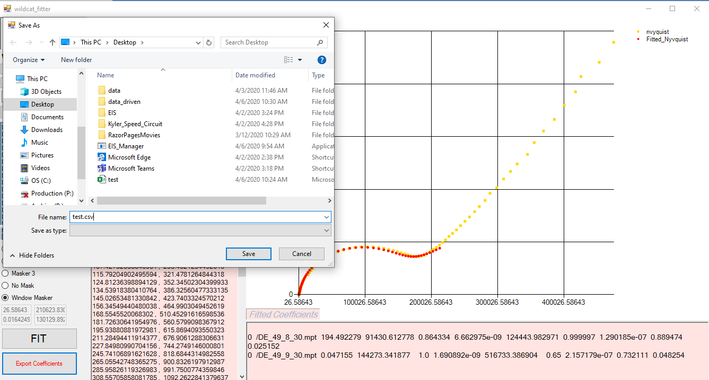

# Export Coefficients

Let's say that we finished fitting and are ready to export the coefficients.

Pressing the export button will allow you to send the Fitted Coefficients box underneath the graph to be exported in the form of a csv file.

Now we can look at the csv file to check one last time

